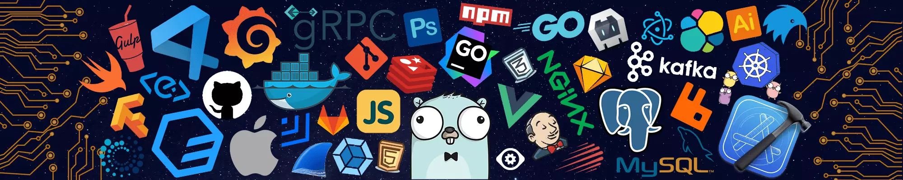

<p align="center">
  
</p>

<table border="0">
  <tr>
    <td width="40%" align="center" valign="middle">
      
    </td>
    <td width="60%" align="left" valign="top">
      <h3 align="left">𝚂𝚄𝙿𝙿𝙾𝚁𝚃:</h3>
      <p align="left">
        <a href="https://www.buymeacoffee.com/maxpavlovs" target="_blank">
          
        </a>
        <br>
        <small><i>Includes perks like comments on my blog and early updates!</i></small>
        <br><br>
        <a href="https://www.patreon.com/maxpavlovs" target="_blank">
          
        </a>
        <br>
        <small><i>Premium perks for dedicated supporters!</i></small>
      </p>
    </td>
  </tr>
</table>


<h1 align="center">
  
  𝐇𝐞𝐥𝐥𝐨, &lt;𝚌𝚘𝚍𝚎𝚛𝚜/&gt;!
  
</h1>

<br/>
<br/>


- 🔭 𝙸’𝚖 𝚌𝚞𝚛𝚛𝚎𝚗𝚝𝚕𝚢 𝚠𝚘𝚛𝚔𝚒𝚗𝚐 𝚘𝚗 **portfolio_projects.**
- 🌱 𝙸’𝚖 𝚌𝚞𝚛𝚛𝚎𝚗𝚝𝚕𝚢 𝚕𝚎𝚊𝚛𝚗𝚒𝚗𝚐 **.**
- 👯 𝙸’𝚖 𝚕𝚘𝚘𝚔𝚒𝚗𝚐 𝚝𝚘 𝚌𝚘𝚕𝚕𝚊𝚋𝚘𝚛𝚊𝚝𝚎 𝚘𝚗 **MERN, WEB-DEV.**
- 💬 𝙰𝚜𝚔 𝙼𝚎 𝙰𝚋𝚘𝚞𝚝 𝙰𝚗𝚢𝚝𝚑𝚒𝚗𝚐 [here](https://github.com/maxgithub0515/maxgithub0515/issues/1) ! 𝙸 𝚊𝚖 𝚑𝚊𝚙𝚙𝚢 𝚝𝚘 𝚑𝚎𝚕𝚙.
- ⚡ 𝙵𝚞𝚗 𝚏𝚊𝚌𝚝 : **𝚃𝚑𝚎 𝚓𝚘𝚞𝚛𝚗𝚎𝚢 𝚒𝚜𝚗'𝚝 𝚊𝚋𝚘𝚞𝚝 𝚝𝚑𝚎 𝚎𝚗𝚍, 𝚋𝚞𝚝 𝚝𝚑𝚎 𝚖𝚘𝚖𝚎𝚗𝚝𝚜 𝚝𝚑𝚊𝚝 𝚖𝚊𝚔𝚎 𝚒𝚝.**

<br/>
<br/>


<p align="center">
   •   
   •
   •
  <a href="https://github.com/sponsors/maxgithub0515"></a>
</p>
<!-- <p align="center">
  <code>
    
  </code>
</p> -->

#

<br/>

**𝙻𝙰𝙽𝙶𝚄𝙰𝙶𝙴𝚂 𝙰𝙽𝙳 𝚃𝙾𝙾𝙻𝚂:**  

<br/>
<br/>

<p align="center">
<code></code>
<code></code>
<code></code>
<code></code>
<code></code>
<code></code>
</p>

#
<p align="center">
<code></code>
<code></code>
<code></code>
<code></code>
<code></code>
<code></code>
<code></code>
<code></code>
</p>

<br/>

#
<p align="center">
<code></code>
<code></code>
<code></code>
<code></code>
<code></code>
<code></code>
<code></code>
</p>
<br/>

#


<!-- <details open="">
<summary>
  <g-emoji class="g-emoji" alias="chart_with_upwards_trend" fallback-src="https://github.githubassets.com/images/icons/emoji/unicode/1f4c8.png">📈</g-emoji>
  <strong>𝙶𝚒𝚝𝚑𝚞𝚋 𝚂𝚝𝚊𝚝𝚜 : </strong>
</summary>
<br/>

<p align="center">
    
    
</p>
</details> -->
<br/>


<h4 align="center">
  
```diff
+@ @ @ @ @ @ @ @ @ @ @ @ @ @ @ @ @ @ @ @ @ @ @ @ @ @ @ @+
@@       o o                                           @@
@@       | |                                           @@
@@      _L_L_                                          @@
@@   ❮\/__-__\/❯ Programming isn't about what you know @@
@@   ❮(|~o.o~|)❯  It's about what you can figure out   @@
@@   ❮/ \`-'/ \❯                                       @@
@@     _/`U'\_                                         @@
@@    ( .   . )     .----------------------------.     @@
@@   / /     \ \    | while( ! (succeed=try() ) ) |     @@
@@   \ |  ,  | /    '----------------------------'     @@
@@    \|=====|/                                        @@
@@     |_.^._|                                         @@
@@     | |"| |                                         @@
@@     ( ) ( )   Testing leads to failure              @@
@@     |_| |_|   and failure leads to understanding    @@
@@ _.-' _j L_ '-._                                     @@
@@(___.'     '.___)                                    @@
+@ @ @ @ @ @ @ @ @ @ @ @ @ @ @ @ @ @ @ @ @ @ @ @ @ @ @ @+
```

</h4>  
  


<br/>

<!-- # -->

<!-- <summary>
  <g-emoji class="g-emoji" alias="chart_with_upwards_trend" fallback-src="https://github.githubassets.com/images/icons/emoji/unicode/1f4c8.png">📈</g-emoji>
  <strong>𝚆𝚊𝚔𝚊𝚃𝚒𝚖𝚎 𝚂𝚝𝚊𝚝𝚜 : </strong>
</summary> -->
<!-- 
 -->

<!-- <br> -->
<!-- <br> -->

<!--START_SECTION:waka-->
<!-- 
**🐱 My GitHub Data** 

> 📦 14.2 MB Used in GitHub's Storage 
 > 
> 🏆 73 Contributions in the Year 2026
 > 
> 💼 Opted to Hire
 > 
> 📜 207 Public Repositories 
 > 
> 🔑 2 Private Repositories 
 > 
**I'm a Night 🦉** 

```text
🌞 Morning                18434 commits       █████░░░░░░░░░░░░░░░░░░░░   18.07 % 
🌆 Daytime                29375 commits       ███████░░░░░░░░░░░░░░░░░░   28.79 % 
🌃 Evening                34638 commits       ████████░░░░░░░░░░░░░░░░░   33.95 % 
🌙 Night                  19579 commits       █████░░░░░░░░░░░░░░░░░░░░   19.19 % 
```
📅 **I'm Most Productive on Sunday** 

```text
Monday                   14178 commits       ███░░░░░░░░░░░░░░░░░░░░░░   13.90 % 
Tuesday                  14235 commits       ███░░░░░░░░░░░░░░░░░░░░░░   13.95 % 
Wednesday                14735 commits       ████░░░░░░░░░░░░░░░░░░░░░   14.44 % 
Thursday                 14078 commits       ███░░░░░░░░░░░░░░░░░░░░░░   13.80 % 
Friday                   14052 commits       ███░░░░░░░░░░░░░░░░░░░░░░   13.77 % 
Saturday                 15002 commits       ████░░░░░░░░░░░░░░░░░░░░░   14.70 % 
Sunday                   15746 commits       ████░░░░░░░░░░░░░░░░░░░░░   15.43 % 
```


📊 **This Week I Spent My Time On** 

```text
🕑︎ Time Zone: Asia/Kolkata

💬 Programming Languages: 
Other                    41 hrs              █████████████████████████   99.92 % 
Java                     1 min               ░░░░░░░░░░░░░░░░░░░░░░░░░   00.06 % 
TeX                      0 secs              ░░░░░░░░░░░░░░░░░░░░░░░░░   00.01 % 

🔥 Editors: 
Chrome                   41 hrs 2 mins       █████████████████████████   100.00 % 

🐱‍💻 Projects: 
izn-thqt-bwx             22 hrs 3 mins       █████████████░░░░░░░░░░░░   53.74 % 
system-design-masterclass18 hrs 57 mins      ████████████░░░░░░░░░░░░░   46.19 % 
Resume                   1 min               ░░░░░░░░░░░░░░░░░░░░░░░░░   00.07 % 
FriendsBook_App          0 secs              ░░░░░░░░░░░░░░░░░░░░░░░░░   00.00 % 

💻 Operating System: 
Mac                      41 hrs 2 mins       █████████████████████████   100.00 % 
```

**I Mostly Code in Jupyter Notebook** 

```text
C++                      20 repos            ███░░░░░░░░░░░░░░░░░░░░░░   13.79 % 
JavaScript               12 repos            ██░░░░░░░░░░░░░░░░░░░░░░░   08.28 % 
Dockerfile               2 repos             ░░░░░░░░░░░░░░░░░░░░░░░░░   01.38 % 
TeX                      1 repo              ░░░░░░░░░░░░░░░░░░░░░░░░░   00.69 % 
R                        1 repo              ░░░░░░░░░░░░░░░░░░░░░░░░░   00.69 % 
```


 Last Updated on 04/02/2026 03:49:22 UTC -->
<!--END_SECTION:waka-->


<br/>

<br/>

<div align="center">

### 𝚂𝚑𝚘𝚠 𝚜𝚘𝚖𝚎 ❤️ 𝚋𝚢 𝚜𝚝𝚊𝚛𝚛𝚒𝚗𝚐 𝚜𝚘𝚖𝚎 𝚘𝚏 𝚝𝚑𝚎 𝚛𝚎𝚙𝚘𝚜𝚒𝚝𝚘𝚛𝚒𝚎𝚜!

</div>

#


